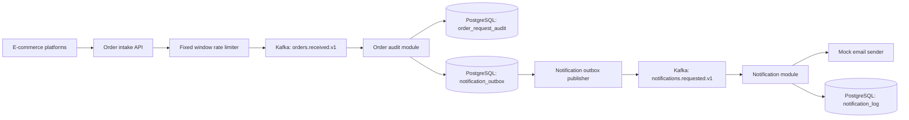

# Order Notification Service

Spring Boot service for accepting high-volume order status requests, storing every request as
an audit entry, and producing mocked email notifications asynchronously through Kafka.

The project is organized as a modular monolith with domain-oriented packages. Package internals
stay package-private where possible. Other modules communicate through public facades and DTOs.

## Architecture



Main modules:

- `orderintake` accepts and validates HTTP requests, controls intake rate, and publishes order events.
- `orderaudit` consumes order events and stores immutable audit data.
- `notificationoutbox` stores pending notification requests and publishes them in batches.
- `notification` consumes notification requests, simulates email sending, and stores notification logs.
- `messaging` contains Kafka message contracts shared between modules.
- `shared` contains cross-module infrastructure DTOs/configuration.

Notification outbox status flow:

```text
PENDING -> PROCESSING -> PUBLISHED
                  |
                  -> PENDING retry
                  -> FAILED after max attempts
```

Outbox entries are claimed with PostgreSQL row locking before publishing. This allows multiple
application instances to process different outbox entries without publishing the same notification
request twice.

## Requirements

- Java 17
- Docker and Docker Compose

## Run Locally With Docker Compose

Start the full stack:

```bash
docker compose up --build
```

Services:

- API: `http://localhost:8080`
- Kafka UI: `http://localhost:8081`
- PostgreSQL: `localhost:5432`
- Kafka: `localhost:9092`

Stop the stack:

```bash
docker compose down
```

Remove persisted PostgreSQL data:

```bash
docker compose down -v
```

## Test The Flow

Create an order status request:

```bash
curl -i -X POST http://localhost:8080/api/v1/orders \
  -H "Content-Type: application/json" \
  -d '{
    "shipmentNumber": "PL123456789",
    "recipientEmail": "recipient@example.com",
    "recipientCountryCode": "PL",
    "senderCountryCode": "DE",
    "statusCode": 42
  }'
```

The response contains a `requestId`:

```json
{
  "requestId": "00000000-0000-0000-0000-000000000000",
  "acceptedAt": "2026-05-22T18:00:00Z"
}
```

Check stored audit data:

```bash
curl http://localhost:8080/api/v1/order-requests/{requestId}
```

Check stored notification log after a short moment:

```bash
curl http://localhost:8080/api/v1/notifications/{requestId}
```

Health endpoint:

```bash
curl http://localhost:8080/actuator/health
```

## Throughput Controls

The application exposes separate controls for intake and notification processing:

| Area | Variable | Default |
| --- | --- | --- |
| Intake rate limit | `INTAKE_RATE_LIMIT_ENABLED` | `true` |
| Intake max requests | `INTAKE_RATE_LIMIT_MAX_REQUESTS` | `100` |
| Intake window | `INTAKE_RATE_LIMIT_WINDOW` | `1s` |
| Order audit consumer concurrency | `ORDER_AUDIT_CONCURRENCY` | `1` |
| Order audit max poll records | `ORDER_AUDIT_MAX_POLL_RECORDS` | `100` |
| Notification consumer concurrency | `NOTIFICATION_CONCURRENCY` | `1` |
| Notification max poll records | `NOTIFICATION_MAX_POLL_RECORDS` | `50` |
| Outbox publishing interval | `NOTIFICATION_OUTBOX_PUBLISH_INTERVAL` | `2s` |
| Outbox batch size | `NOTIFICATION_OUTBOX_BATCH_SIZE` | `50` |
| Outbox retry delay | `NOTIFICATION_OUTBOX_RETRY_DELAY` | `10s` |
| Outbox max attempts | `NOTIFICATION_OUTBOX_MAX_ATTEMPTS` | `3` |

## Run Tests

```bash
./gradlew test
```

## Deployment

Public deployment URL and external smoke-test instructions will be added after the service is
deployed to a free hosting environment.
